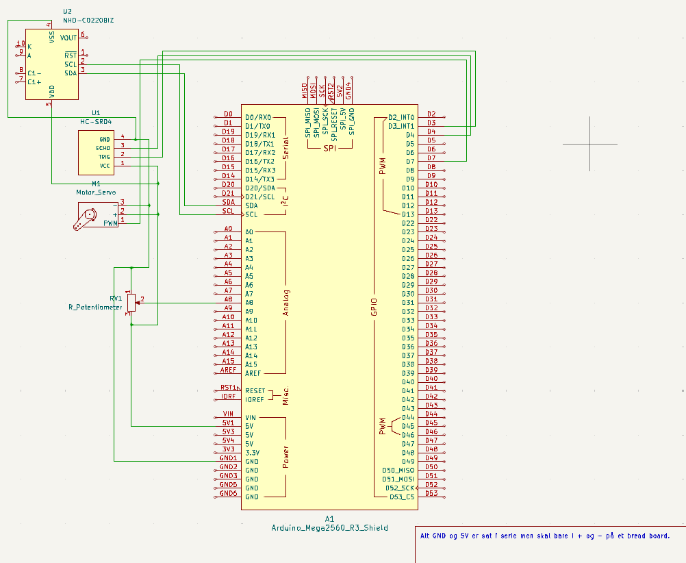

# DemoBoard
DemoBoard er et arduino board på hacklab videndjurs der er lavet til at vise hvordan ting virker

## Arduino IDE

Hvis man bruger arduino ide til at lave vidre på dette project så kan man ignorere platformio.ini filen

## PlatformIO

Hvis man vælger at bruge platformio burde man bare kunne få det hele til at virke med at inkludere platformio.ini filen da den inkludere hvilket board der bliver brugt og hvilke libraries der skal bruges

## Project schematic

